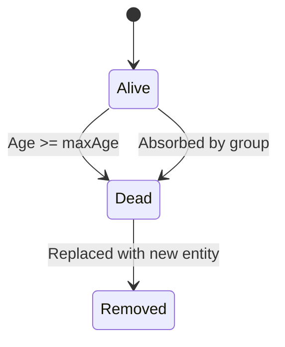
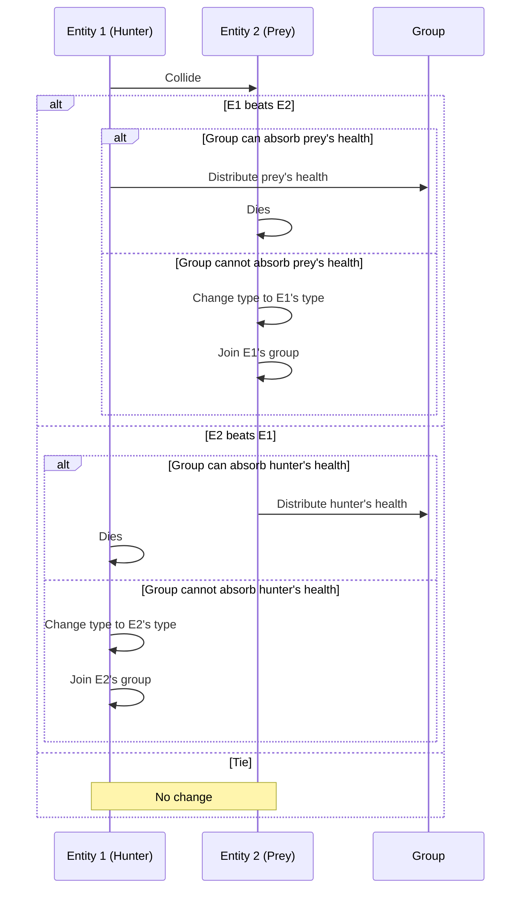

**This animation was created by Vibe-Coding using this AI: [Quasar Alpha](https://openrouter.ai/openrouter/quasar-alpha)**

---

# RPSLS Simulation

A mesmerizing, emergent simulation inspired by Rock-Paper-Scissors-Lizard-Spock (RPSLS), visualized with animated emoji entities on an HTML5 Canvas.

---

## Features

- **Entities:** Rock 🪨, Paper 📄, Scissors ✂️, Lizard 🦎, Spock 🖖
- **Properties:** Position, velocity, type, age, health bar, group ID
- **Movement:** Entities move continuously, bounce off edges, and are gently nudged back inside if near the viewport boundary
- **Interactions:**
  - When two entities collide, RPSLS rules determine the winner
  - If the winner's group can absorb the loser's remaining health without exceeding full health, the loser's health is distributed evenly among the group and the loser dies
  - If not, the loser changes type to the winner and joins the winner's group
  - No health reset occurs during these interactions; health is preserved or redistributed
- **Lifespan:**
  - Entities age over time (~60 seconds max)
  - When lifespan expires, entity is replaced with a new random entity
- **Health Bar:**
  - Above each entity, showing remaining lifespan
  - Transitions from green → orange → red as entity ages
  - Semi-transparent and subtle, close to the entity
- **Hitbox:**
  - Visualized as a faint circle (~64% of emoji size)
  - Used for collision detection and separation
- **Group Dynamics:**
  - Each entity belongs to a group (colored square indicator)
  - Groups split into two when exceeding 7 members
  - New entities join existing groups with <7 members or form new groups
  - When two groups of the same type collide, if their combined size is 7 or fewer, they merge into a single group
  - Same-group entities flock together via attraction and alignment
  - Different groups of the same type repel slightly
  - Health is gradually redistributed among close, same-group entities over time, balancing health within the group
- **Flocking Behavior:**
  - Gentle attraction within groups
  - Stronger repulsion when very close to avoid overlap
  - Velocity alignment causes groups to move cohesively
  - Hard separation correction prevents perfect overlap
- **Boundary Handling:**
  - Soft force near edges keeps groups inside viewport
  - Hard bounce if an entity crosses the exact edge
- **Continuous Dynamics:**
  - No UI controls; simulation starts automatically
  - Canvas fills the entire browser window
  - Dark mode color scheme for comfortable viewing

---

## RPSLS Rules

```js
const beats = {
  rock: ["scissors", "lizard"],
  paper: ["rock", "spock"],
  scissors: ["paper", "lizard"],
  lizard: ["paper", "spock"],
  spock: ["scissors", "rock"],
};
```

- Rock crushes Scissors and crushes Lizard
- Paper covers Rock and disproves Spock
- Scissors cuts Paper and decapitates Lizard
- Lizard eats Paper and poisons Spock
- Spock smashes Scissors and vaporizes Rock

---

## Entity Lifecycle



---

## Interaction Flow



---

## How to Run

1. Open `index.html` in any modern web browser.
2. Observe the emergent behavior as entities move, interact, evolve, split into groups, and compete.

---

## Technologies

- HTML5 Canvas
- JavaScript (vanilla)
- Emoji for entity visualization
- Mermaid diagrams (optional, for documentation)

---

## Emergent Behavior

Over time, you'll see:

- Clusters of same-type entities forming distinct groups
- Groups splitting when they grow too large
- Groups competing and converting each other based on RPSLS rules
- Aging entities replaced by new random ones, maintaining diversity
- Dynamic, colorful, organic animation reminiscent of natural swarms or "frog spawn"

---
