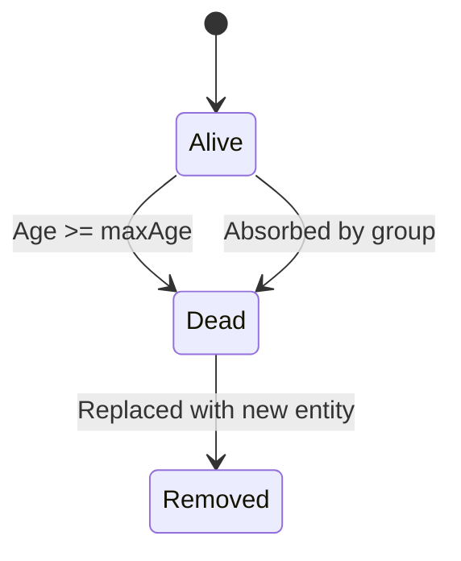
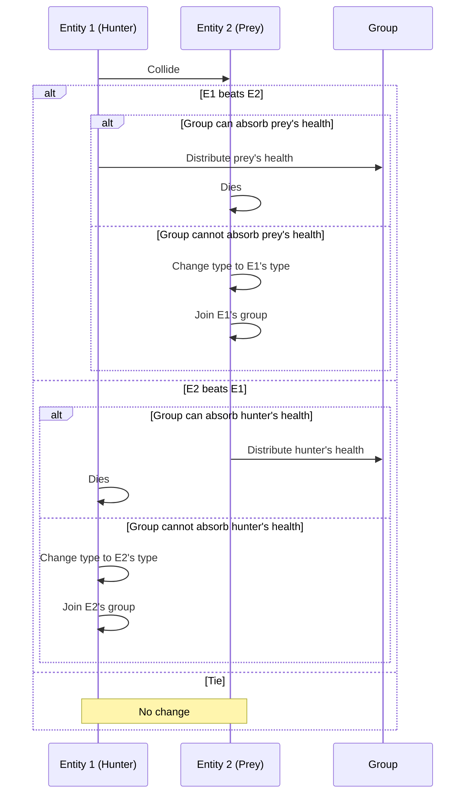

**This animation was created by Vibe-Coding using these AI's**
- [Quasar Alpha](https://openrouter.ai/openrouter/quasar-alpha)
- [Sonoma Dusk Alpha](https://openrouter.ai/openrouter/sonoma-dusk-alpha)


---

# RPSLS Simulation

A mesmerizing, emergent simulation inspired by Rock-Paper-Scissors-Lizard-Spock (RPSLS), featuring animated emoji entities with flocking behavior, real-time statistics, and oscilloscope-style population graphing. Built with maintainable, modular JavaScript using centralized configuration, error handling, input validation, and responsive design for desktop and mobile.

Refactored for production readiness with comprehensive JSDoc documentation, separated simulation/UI logic, and high-DPI support via devicePixelRatio scaling.

---

## Features

### Core Simulation
- **Entities:** Rock 🪨, Paper 📄, Scissors ✂️, Lizard 🦎, Spock 🖖 with position, velocity, type, age, health bar, and group ID
- **Movement & Physics:** Continuous motion with edge bouncing, soft boundary forces, and speed clamping between CONFIG.TARGET_SPEED and CONFIG.MAX_SPEED
- **Interactions:** RPSLS rule-based collisions with health redistribution or type/group conversion; intra-group flocking (alignment, attraction, repulsion) and health balancing
- **Lifespan & Replacement:** Entities age up to CONFIG.MAX_AGE_SECONDS (60s); dead entities replaced with new random spawns; damage cooldown CONFIG.DAMAGE_COOLDOWN_FRAMES (2s)
- **Group Dynamics:** Groups limited to 7 members (split when exceeded); merging for same-type collisions ≤7 total; HSL-colored by groupId for visual distinction
- **Health Visualization:** Dynamic health bars (green >50%, yellow 25-50%, red <25%) with validation clamping 0-1
- **Collision Detection:** Hitbox-based (CONFIG.HITBOX_RADIUS = 64% entity radius) with separation correction and velocity bounds checking

### UI & Visualization
- **Real-time Statistics Panel:** Bottom-center (mobile) or top-right (desktop) showing count and avg health % for each type; updates 4×/second (CONFIG.STATS_UPDATE_INTERVAL = 15 frames)
- **Oscilloscope-style Graph:** Top-left (desktop) or full-width top (mobile) with glowing traces for adjusted count (count × avg health) over 1-minute window (CONFIG.TIME_WINDOW_SECONDS = 60); updates 4×/second
  - Traces: Gray (rock), white (paper), red (scissors), green (lizard), yellow (spock) with CONFIG.GRAPH_GLOW_BLUR = 6
  - Current value icons positioned at trace heights; responsive sizing (CONFIG.ICON_MOBILE_SIZE = 18, etc.)
  - Minimal green axes (COLORS.AXIS_COLOR = '#00ff00'); time label "1 min window"
- **ND-Filter Overlay:** Subtle rgba(0,0,0,0.4) darkening on graph/stats for UI subtlety (CONFIG.ND_FILTER_OPACITY = 0.4)
- **Layering:** Simulation z-index 3 (foreground), UI z-index 2, source link z-index 4
- **Responsive Design:** Breakpoints at CONFIG.MOBILE_BREAKPOINT = 768px and VERY_SMALL_BREAKPOINT = 480px; viewport percentages for sizing; font/icon scaling

### Technical Architecture
- **Centralized Configuration:** CONFIG object for all constants (simulation physics, UI intervals, responsive breakpoints, z-indexes); COLORS for theming
- **Modular Functions:** Graph rendering split into calculateDimensions(), drawAxes(), drawTraces(), drawIcons(), applyOverlay(); simulation separated from UI in updateSimulation() and updateUI()
- **Error Handling:** Try-catch in UI functions; guards for empty history, division by zero, invalid contexts/data
- **Input Validation:** Bounds checking in positions/speeds/ages/health; non-negative clamps; safe division
- **Resize Handling:** Full canvas support with devicePixelRatio scaling; conditional UI updates post-initialization to avoid ReferenceErrors
- **Performance:** 60 FPS simulation, 4 FPS UI updates; automatic history pruning; efficient collision detection O(n²) with early exits

### RPSLS Rules
```js
const beats = {
  rock: ["scissors", "lizard"],
  paper: ["rock", "spock"],
  scissors: ["paper", "lizard"],
  lizard: ["paper", "spock"],
  spock: ["scissors", "rock"],
};
```
- Rock crushes Scissors/decapitates Lizard
- Paper covers Rock/disproves Spock
- Scissors cuts Paper/poisons Lizard
- Lizard eats Paper/poisons Spock
- Spock smashes Scissors/vaporizes Rock

---

## RPSLS Rules

```js
const beats = {
  rock: ["scissors", "lizard"],
  paper: ["rock", "spock"],
  scissors: ["paper", "lizard"],
  lizard: ["paper", "spock"],
  spock: ["scissors", "rock"],
};
```

- Rock crushes Scissors and crushes Lizard
- Paper covers Rock and disproves Spock
- Scissors cuts Paper and decapitates Lizard
- Lizard eats Paper and poisons Spock
- Spock smashes Scissors and vaporizes Rock

---

## Entity Lifecycle



---

## Interaction Flow



---

## How to Run

1. Clone/open the project directory
2. Open `index.html` in a modern browser (Chrome, Firefox, Safari, Edge)
3. The simulation starts automatically at 60 FPS
4. Resize the browser window to see responsive UI adaptation (mobile/desktop layouts)
5. No build tools required - vanilla HTML/CSS/JS

### Development
- Edit CONFIG/COLORS objects in script.js for simulation/UI customization
- View JSDoc comments in script.js for function details
- Test on mobile devices for responsive behavior

---

## Technologies & Architecture

- **Frontend:** HTML5 Canvas 2D, vanilla JavaScript (ES6+)
- **Visualization:** Emoji symbols, HSL group coloring, CSS for basic styling/media queries
- **Architecture:** Modular functions with separation of concerns (simulation vs UI); centralized CONFIG/COLORS objects
- **Responsive:** JavaScript-based viewport detection with devicePixelRatio for high-DPI sharpness
- **Documentation:** JSDoc for all functions; Mermaid diagrams for flows
- **Compatibility:** Modern browsers (ES6+); mobile-optimized with touch-friendly scaling

---

## Emergent Behavior

Over time, you'll see:

- Clusters of same-type entities forming distinct groups
- Groups splitting when they grow too large
- Groups competing and converting each other based on RPSLS rules
- Aging entities replaced by new random ones, maintaining diversity
- Dynamic, colorful, organic animation reminiscent of natural swarms or "frog spawn"

## Statistics and Visualization

### Real-time Statistics Panel
- **Position:** Top-right (desktop, CONFIG.UI_Z_INDEX = 2) or bottom-center (mobile)
- **Content:** Current count and average health % for each type with emoji symbols
- **Update Rate:** CONFIG.STATS_UPDATE_INTERVAL = 15 frames (4×/second at 60 FPS)
- **Responsive:** CONFIG.STATS_MOBILE_WIDTH_PCT = 0.9 width, scaled fonts (CONFIG.FONT_MOBILE_SIZE = 12)
- **Error Handling:** Guards for invalid data; fallback to 0% health

### Oscilloscope-style Graph
- **Position:** Top-left (desktop) or full-width top (mobile, z-index 2)
- **Data:** Adjusted count (count × avgHealth) trends over CONFIG.TIME_WINDOW_SECONDS = 60s window
- **Update Rate:** CONFIG.GRAPH_UPDATE_INTERVAL = 15 frames (4×/second)
- **Traces:** Glowing lines (CONFIG.GRAPH_GLOW_BLUR = 6) in COLORS.GRAPH_LINE_COLORS:
  - Rock: #808080 (gray)
  - Paper: #ffffff (white)
  - Scissors: #ff0000 (red)
  - Lizard: #00ff00 (green)
  - Spock: #ffff00 (yellow)
- **Features:** Minimal green axes (COLORS.AXIS_COLOR), current value icons at trace heights, "1 min window" label
- **Scaling:** Y-range from data min/max or CONFIG.GRAPH_DEFAULT_MAX_Y = 30; time scale = graphWidth / 60s
- **Responsive:** Height percentages (0.33 desktop, 0.25 mobile, 0.20 very small); icon/font scaling

### ND-Filter Overlay
- **Effect:** Semi-transparent darkening (COLORS.ND_FILTER_COLOR = rgba(0,0,0,0.4)) on graph/stats
- **Purpose:** Reduces UI prominence, focuses attention on simulation entities

### High-DPI Support
- **Scaling:** devicePixelRatio applied to all canvas dimensions and contexts
- **Sharpness:** ctx.scale(dpr, dpr) for crisp rendering on Retina/4K displays

### Initialization & Error Handling
- **Graceful Startup:** Conditional UI skips during init to avoid ReferenceErrors with uninitialized globals
- **Runtime Guards:** Try-catch in UI functions; validation for empty history, zero-division, invalid contexts
- **Logging:** console.warn for non-fatal issues without disrupting simulation

---

## Technical Implementation

### Canvas Management
- **Three Canvases:** Simulation (main), Graph (oscilloscope), Stats (panel)
- **Dynamic Sizing:** JavaScript calculates dimensions based on viewport
- **CSS Support:** Media queries handle positioning and basic styling
- **Resize Handling:** Canvas dimensions update on window resize events

### Data Collection
- **computeStats():** Calculates type counts and average health every 15 frames
- **updateGraphHistory():** Records timestamped "adjusted count" values 4×/second
- **Time-based Data:** Each data point includes timestamp for accurate scrolling
- **Memory Management:** Automatically removes data older than 1-minute window

### Rendering Pipeline
1. **updateEntities():** Physics, collisions, group dynamics (60 FPS)
2. **drawEntities():** Clear simulation canvas, draw entities with health bars
3. **drawStats():** Update and render stats panel (4×/second)
4. **drawGraph():** Render oscilloscope traces with glow effects (every frame)
5. **ND-filter Overlay:** Semi-transparent darkening applied last

### Color Scheme
- **Entity Groups:** HSL-based rainbow colors based on group ID
- **Health Bars:** Green → Orange → Red gradient based on remaining lifespan
- **Graph Traces:** Type-specific colors matching icons for visual consistency
- **UI Elements:** Monochrome with green accents for oscilloscope aesthetic

---

## Performance & Architecture

- **Frame Rate:** 60 FPS simulation (CONFIG.FPS), 4 FPS UI (CONFIG.STATS_UPDATE_INTERVAL/GRAPH_UPDATE_INTERVAL = 15)
- **Modularity:** Simulation core (updateSimulation) separate from rendering (drawEntities, updateUI); graph modularized into 5 helpers
- **Memory:** Sliding window prunes typeHistory older than CONFIG.TIME_WINDOW_SECONDS; dynamic canvas sizing
- **Efficiency:** O(n²) collisions with early exits; validation prevents infinite loops/invalid states
- **Responsive:** Viewport-based sizing; media queries in CSS; dpr scaling for high-DPI
- **Robustness:** Input validation clamps values; error handling catches edge cases without crashes

---

## Configuration & Customization

### Centralized Settings (script.js)
- **CONFIG Object:** All constants (physics: ENTITY_RADIUS=30, MAX_SPEED=2.4; UI: STATS_UPDATE_INTERVAL=15; responsive: MOBILE_BREAKPOINT=768)
- **COLORS Object:** Theming (GRAPH_LINE_COLORS for traces, HEALTH_BAR_GREEN/YELLOW/RED, AXIS_COLOR='#00ff00')
- **Adjust:** Modify values in CONFIG/COLORS for simulation tuning or retheming without code changes

### Graph & Stats
- Time window: CONFIG.TIME_WINDOW_SECONDS = 60 (1 min scrolling)
- Update rate: CONFIG.GRAPH_UPDATE_INTERVAL = 15 (4×/s)
- Y-scale default: CONFIG.GRAPH_DEFAULT_MAX_Y = 30
- Glow: CONFIG.GRAPH_GLOW_BLUR = 6

### Responsive Design
- Breakpoints: MOBILE_BREAKPOINT=768px, VERY_SMALL_BREAKPOINT=480px
- Percentages: GRAPH_MOBILE_HEIGHT_PCT=0.25, STATS_MOBILE_WIDTH_PCT=0.9
- Icons/Fonts: ICON_MOBILE_SIZE=18, FONT_DESKTOP_SIZE=10

### Visual Effects
- Entity glow: shadowBlur=16, hsla(groupId-based hue, 80%, 50%, 0.5)
- ND-filter: COLORS.ND_FILTER_COLOR = 'rgba(0,0,0,0.4)'
- Health bars: Dynamic rgba gradients based on ratio (0-1 clamped)

### Development Tips
- View JSDoc: Use VSCode IntelliSense or jsdoc-to-markdown tools
- Test Resize: Browser dev tools device emulation
- Debug: Console warnings for errors; frameCount for timing
- Customize: Edit CONFIG/COLORS; extend Entity class for new behaviors

---

## Browser Compatibility & Testing

- **Desktop:** Chrome 80+, Firefox 75+, Safari 13+, Edge 80+ (ES6+ required)
- **Mobile:** iOS Safari 13+, Chrome Mobile 80+, Firefox Mobile 75+
- **Canvas:** HTML5 Canvas 2D (universal support)
- **High-DPI:** devicePixelRatio scaling for Retina/4K sharpness
- **Performance:** 60 FPS desktop, 30+ FPS mobile; O(n²) collisions optimized with early exits
- **Testing:** Responsive via browser dev tools; error-free init confirmed

## Future Enhancements
- Pause/Resume and speed controls via UI buttons
- Data export (CSV of graph history)
- Multiple time windows (15s/1m/5m toggle)
- WebGL 3D upgrade for depth effects
- ML analysis of emergent patterns
- Audio feedback for interactions
- Theme switching (light/dark modes)

---
