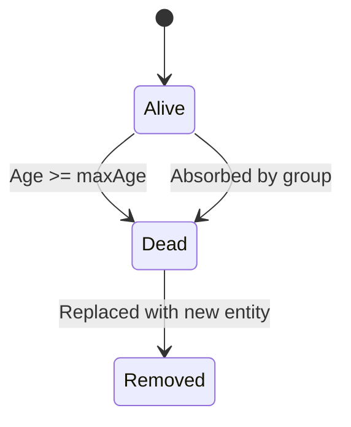
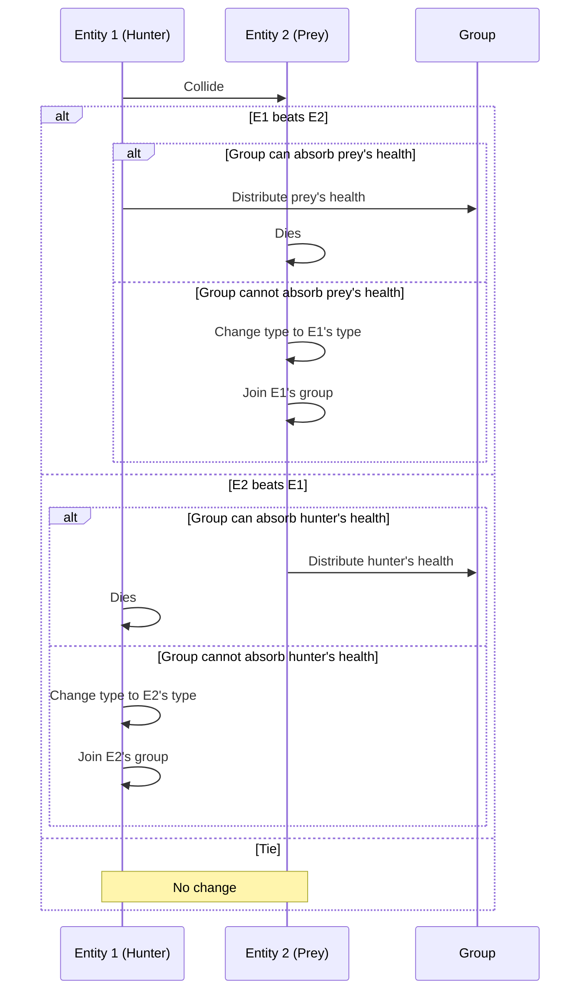

# Architecture

Technical implementation details of the RPSLS Simulation.

## Core Simulation

### Entities

Each entity has the following properties:

- **Position & Velocity** - Continuous motion with physics
- **Type** - Rock 🪨, Paper 📄, Scissors ✂️, Lizard 🦎, or Spock 🖖
- **Age** - Entities live up to `CONFIG.MAX_AGE_SECONDS` (60s)
- **Health** - 0-1 range with visual health bars
- **Group ID** - For flocking and visual coloring

### Movement & Physics

- Continuous motion with edge bouncing
- Soft boundary forces
- Speed clamping between `CONFIG.TARGET_SPEED` and `CONFIG.MAX_SPEED`

### Collision Detection

- Hitbox-based (`CONFIG.HITBOX_RADIUS = 64%` entity radius)
- Separation correction on collision
- Velocity bounds checking

### Interaction System

When two entities collide:

1. Check RPSLS rules to determine winner
2. If winner's group can absorb health → distribute prey's health, prey dies
3. Otherwise → prey converts to winner's type and joins winner's group

### Group Dynamics

- Groups limited to 7 members (split when exceeded)
- Merging for same-type collisions (≤7 total)
- Intra-group flocking: alignment, attraction, repulsion
- Health balancing within groups
- HSL coloring by groupId for visual distinction

### Lifespan & Replacement

- Entities age up to `CONFIG.MAX_AGE_SECONDS` (60s)
- Dead entities replaced with new random spawns
- Damage cooldown: `CONFIG.DAMAGE_COOLDOWN_FRAMES` (2s)

## Entity Lifecycle

## Interaction Flow

## Technical Stack

- **Frontend:** HTML5 Canvas 2D, vanilla JavaScript (ES6+)
- **Architecture:** Modular functions with separation of concerns
- **Responsive:** JavaScript-based viewport detection with devicePixelRatio for high-DPI

## Canvas Management

Three canvases:

1. **Simulation** - Main entity rendering (z-index 3)
2. **Graph** - Oscilloscope-style population chart (z-index 2)
3. **Stats** - Real-time statistics panel (z-index 2)

## Rendering Pipeline

1. `updateEntities()` - Physics, collisions, group dynamics (60 FPS)
2. `drawEntities()` - Clear simulation canvas, draw entities with health bars
3. `drawStats()` - Update and render stats panel (4×/second)
4. `drawGraph()` - Render oscilloscope traces with glow effects (every frame)
5. ND-filter Overlay - Semi-transparent darkening applied last

## Performance

- **Frame Rate:** 60 FPS simulation, 4 FPS UI updates
- **Collision Detection:** O(n²) with early exits
- **Memory:** Automatic history pruning (1-minute sliding window)
- **High-DPI:** devicePixelRatio scaling for Retina/4K displays

## Error Handling

- Try-catch in UI functions
- Guards for empty history, division by zero, invalid contexts
- Input validation with bounds checking
- Non-negative clamps and safe division

## Browser Compatibility

- **Desktop:** Chrome 80+, Firefox 75+, Safari 13+, Edge 80+
- **Mobile:** iOS Safari 13+, Chrome Mobile 80+, Firefox Mobile 75+
- **Requirements:** ES6+ JavaScript, HTML5 Canvas 2D
